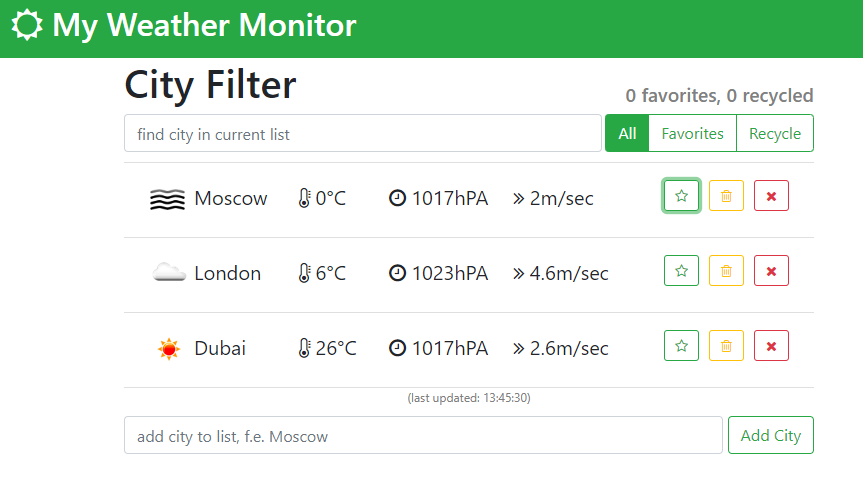

# My Weather Monitor
> Monitor city weather.

[![NPM Version][npm-image]][npm-url]
[![Build Status][travis-image]][travis-url]
[![Downloads Stats][npm-downloads]][npm-url]

Simple program to monitor city weather using React and openweathermap.org api.



## Installation

OS X & Linux:

```sh
git clone https://github.com/2pikin/todo.git
cd todo
npm install
```

Windows:

```sh
git clone https://github.com/2pikin/todo.git
cd todo
npm install
```

## Development setup

Test server start on http://localhost:3000. To start server please follow the steps below:

```sh
cd todo
npm start
```

## Release History

* 0.1.1
    * FIX: City filters
* 0.1.0
    * The first proper release
    * ADD: Setup weather auto update
* 0.0.1
    * Work in progress

## Meta

Vasily Tupikin – 2pikin@gmail.com

Distributed under the MIT license. See ``LICENSE`` for more information.

<!-- Markdown link & img dfn's -->
[npm-image]: https://img.shields.io/npm/v/datadog-metrics.svg?style=flat-square
[npm-url]: https://npmjs.org/package/datadog-metrics
[npm-downloads]: https://img.shields.io/npm/dm/datadog-metrics.svg?style=flat-square
[travis-image]: https://img.shields.io/travis/dbader/node-datadog-metrics/master.svg?style=flat-square
[travis-url]: https://travis-ci.org/dbader/node-datadog-metrics
